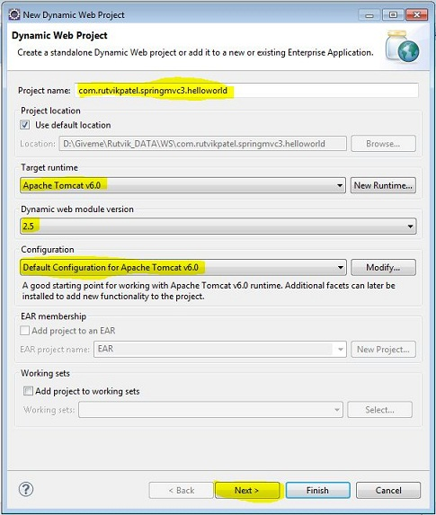
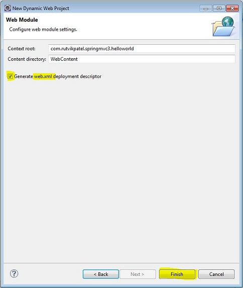
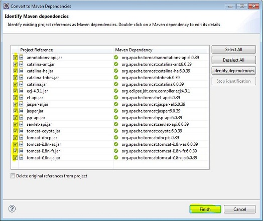

# springmvc-3-hello-world
Day 4 - Spring MVC 3.0 - Hello World Example

> In this tutorial, we show you how to create Spring 3.0 MVC hello world example in simplest way.


### Project Structure


### Output


#### Step 1 - Let’s Setup Environment

1. Spring 3.2.13.RELEASE and any latest version
2. Maven 3 and any latest version
3. JDK 1.6 / JDK 1.7 / JDK 1.8 / JDK 1.9
4. Eclipse Kepler / Eclipse Juno / Eclipse Neon
5. Tomcat 6 / Tomcat 7 / Tomcat 8 / Tomcat 9

#### Step 2 - Create Project
> Click on File > New > Dynamic Web Project




#### Step 3 - Convert as Maven Project
> Click Right click on Project > Configure > Convert to Maven project



```
<project xmlns="http://maven.apache.org/POM/4.0.0" 
	xmlns:xsi="http://www.w3.org/2001/XMLSchema-instance" 
	xsi:schemaLocation="http://maven.apache.org/POM/4.0.0 http://maven.apache.org/xsd/maven-4.0.0.xsd">
  <modelVersion>4.0.0</modelVersion>
  <groupId>com.rutvikpatel.springmvc3.helloworld</groupId>
  <artifactId>com.rutvikpatel.springmvc3.helloworld</artifactId>
  <version>0.0.1-SNAPSHOT</version>
  <packaging>war</packaging>
  
	<properties>
		<jdk.version>1.6</jdk.version>
		<spring.version>3.2.13.RELEASE</spring.version>
		<jstl.version>1.2</jstl.version>
	</properties>

	<dependencies>
		<dependency>
			<groupId>org.springframework</groupId>
			<artifactId>spring-webmvc</artifactId>
			<version>${spring.version}</version>
		</dependency>
		<dependency>
			<groupId>javax.servlet</groupId>
			<artifactId>jstl</artifactId>
			<version>${jstl.version}</version>
		</dependency>
		<dependency>
		    <groupId>javax.servlet</groupId>
		    <artifactId>javax.servlet-api</artifactId>
		    <version>3.0.1</version>
		    <scope>provided</scope>
		</dependency>
	</dependencies>
  
  <build>
    <sourceDirectory>src</sourceDirectory>
    <plugins>
      <plugin>
        <artifactId>maven-compiler-plugin</artifactId>
        <version>3.1</version>
        <configuration>
          <source>1.7</source>
          <target>1.7</target>
        </configuration>
      </plugin>
      <plugin>
        <artifactId>maven-war-plugin</artifactId>
        <version>2.3</version>
        <configuration>
          <warSourceDirectory>WebContent</warSourceDirectory>
          <failOnMissingWebXml>false</failOnMissingWebXml>
        </configuration>
      </plugin>
    </plugins>
  </build>
</project>
```

